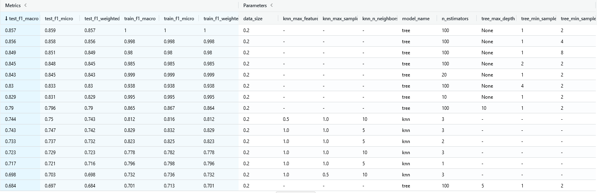
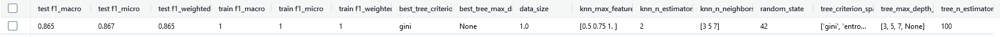
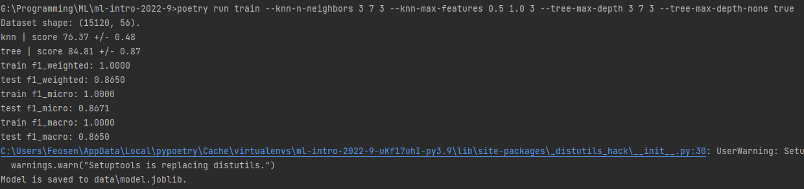
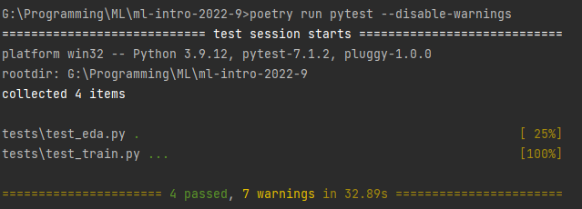
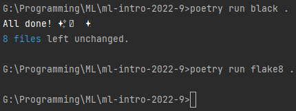
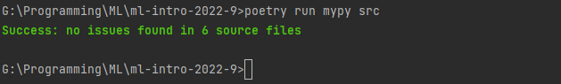
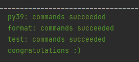
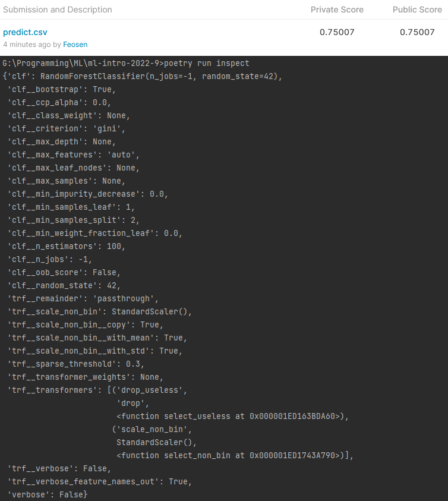

# ML-intro-2022-9
[](https://github.com/Feosen/ml-intro-2022-9/actions/workflows/python-package.yml)

## Usage
This package allows you to train model for forest cover type prediction.
1. Clone this repository to your machine.
2. Download [Forest train dataset](https://www.kaggle.com/competitions/forest-cover-type-prediction) dataset, save csv locally (default path is *data/train.csv* in repository's root).
3. Make sure Python 3.9 and [Poetry](https://python-poetry.org/docs/) are installed on your machine (I use Poetry 1.1.13).
4. Install the project dependencies (*run this and following commands in a terminal, from the root of a cloned repository*):
```sh
poetry install --no-dev
```
5. Activate shell:
```sh
poetry shell
```
6. Run train with the following command:
```sh
poetry run train -d <path to csv with data> -s <path to save trained model>
```
You can configure additional options (such as hyperparameters) in the CLI. To get a full list of them, use help:
```sh
poetry run train --help
```
7. Run MLflow UI to see the information about experiments you conducted:
```sh
poetry run mlflow ui
```
8. Deactivate shell:
```sh
exit
```
## EDA
Run EDA creation with the following command:
```sh
poetry run eda -d <path to csv with data> -s <path to save eda.html>
```

## Development

The code in this repository must be tested, formatted with black, and pass mypy typechecking before being commited to the repository.

Install all requirements (including dev requirements) to poetry environment:
```
poetry install
```
Now you can use developer instruments, e.g. pytest:
```
poetry run pytest
```
More conveniently, to run all sessions of testing and formatting in a single command, install and use [tox](https://github.com/tox-dev/tox): 
```
tox
```

## Tasks

### Task 1-6
This git.

### Task 7
Cross-validation and 3 metrics provided [here](https://github.com/Feosen/ml-intro-2022-9/tree/ed664c85a14907406257a3218c985d2d48b70de0).
*Note*: duplicated metric was replaced [here](https://github.com/Feosen/ml-intro-2022-9/commit/914a8fd81e560811deae2cc7924c96ef549dd27f).

### Task 8

I had to run experiments on reduced dataset because of hardware limitation. I think it is better than nothing (for study task).



### Task 9




### Task 10
This Readme.

### Task 11
Using ```--disable-warnings``` because of pandas-profiling.



### Task 12



### Task 13



### Task 14
Screenshot is very big because I don't supress warnings and other info in tox configuration, so here is short version.
Full screenshot provided [here](docs/images/tox-full.png).



### Task 15
Don't miss [Actions](https://github.com/Feosen/ml-intro-2022-9/actions), please.

### Bonus Evaluation Selection

